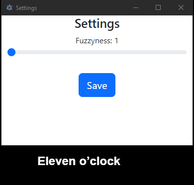
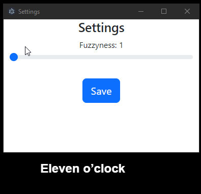

# FuzzyClock

A simple Electron application that displays a fuzzy clock. 🕒✨







## Features

- **Fuzzy Clock**: Displays the current time with a fuzzy effect.
  - 🔄 Adjusts dynamically based on the hour.
- **Settings**: Adjust the fuzzyness level of the clock.
  - 🔧 Change settings directly from the app.

## Installation

1. Clone this repository:

```sh
git clone https://github.com/tesla-srt/js-fuzzyclock.git
```

2. Navigate to the project directory:

```sh
cd js-fuzzyclock
```

3. Install dependencies:

```sh
npm install
```

## Running the application

To run the application, use the following command:

```
npm start
```

### TODO

- ~~**Configuration Saving**: 🔄 Implement functionality to save other configurations such as font color and family. (High Priority)~~
- **Localization**: 🔄 Implement functionality to support the display of other languages (i18n). (High Priority)
- **Style Enhancements**: 🔄 Make it cleaner and more customizable. (High Priority)
- **Font Color and Family**: 🔧 Allow users to change the font color and family from the settings. (Medium Priority)
- **Background Transparency**: 👀 Add functionality to toggle background transparency. (Low Priority)
